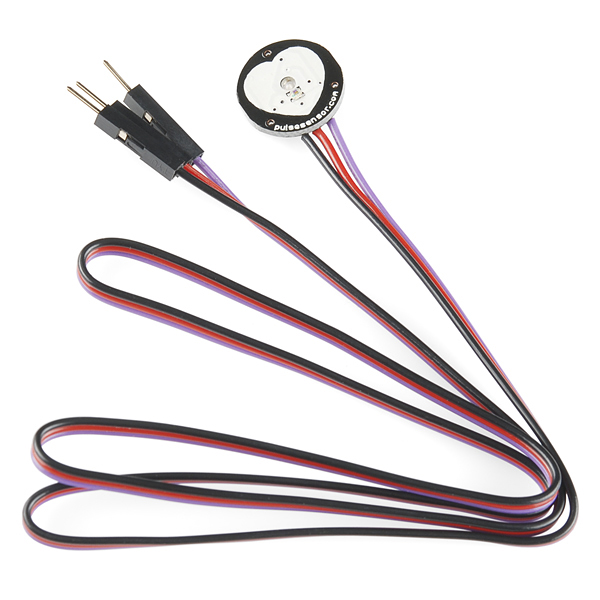
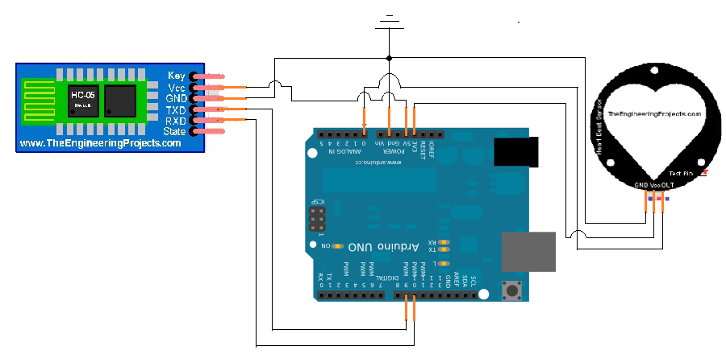
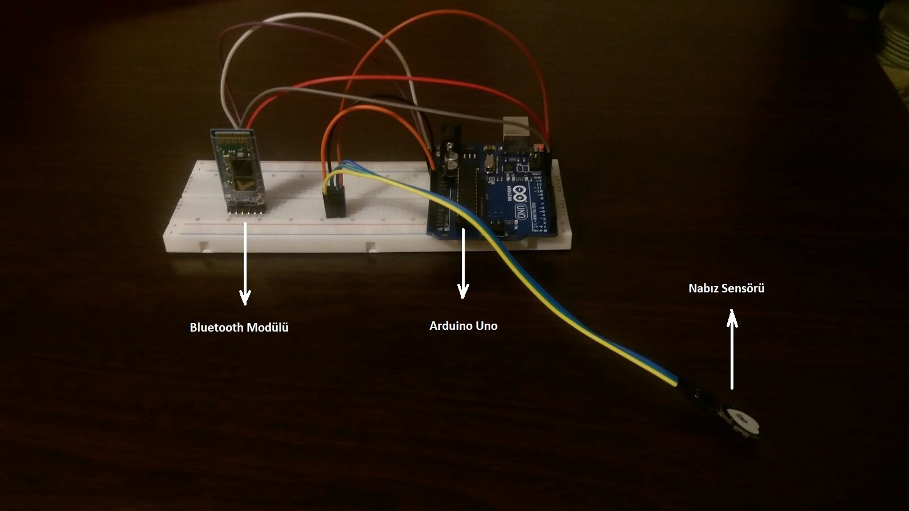
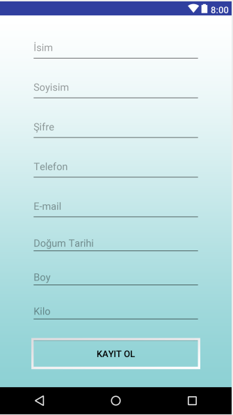
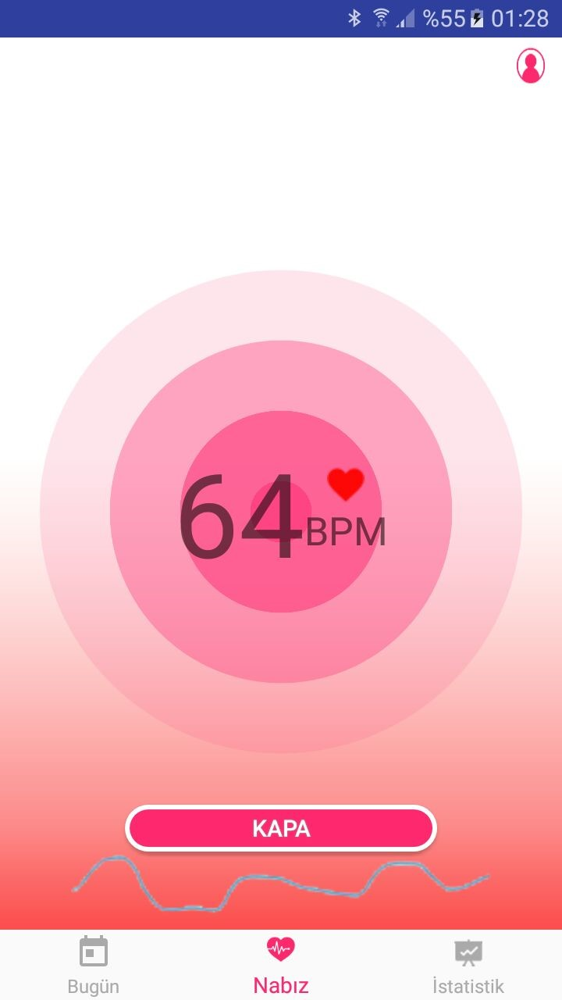
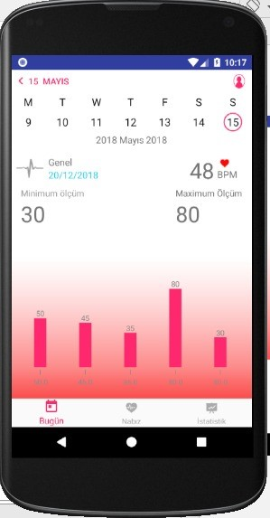
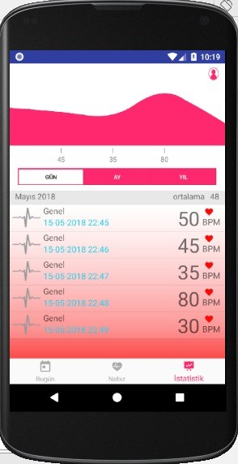
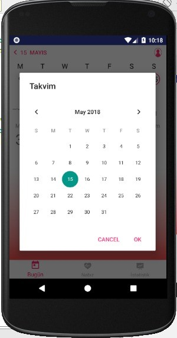

# Heart_Rate_Monitor

A project that allow users to track their bpm rate realtime, via arduino uno and bluetooth module.

Used Pulse Sensor

Hardware Design

System

Login Screen

Sign-up Screen

Realtime BPM Monitor

BPM Values by Dates

BPM Values by Dates

Date Select
